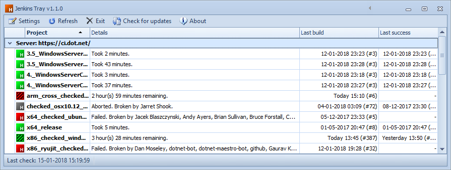
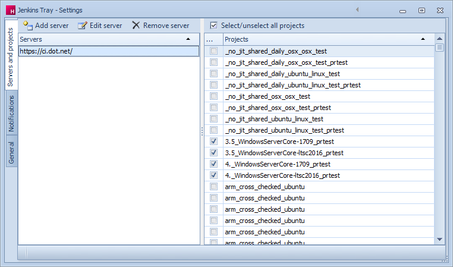

 

# Jenkins Tray

**Jenkins Tray** is a fork of [Hudson Tray Tracker](https://github.com/aseigneurin/hudson-tray-tracker). You can see a lot of similarities from the original project.

It is a small application that monitors projects configured on [Jenkins CI](https://jenkins.io) servers. It sits in the Windows tray to display an icon showing the worst build status.

The main features are:

* Multi-server support
* Project selection for each server
* Folder / multibranch pipeline project type support
* Tray icon with bright colors:
  * green: all is good
  * yellow: at least one project has test failures
  * red: at least one project does not build
  * gray: at least one project is indeterminate
  * animated icons: currently building, the background inherits the last build status.
* Balloon warning in the tray when a project regresses (when a build fails, for instance)
* Open the project page (from the main window)
* Open the last build's console output (from the main window)
* Run a build (from the main window)
* Auto-refresh every 15 seconds
* Application auto-update (checks at startup and every hour)

# Requirements

Jenkins Tray runs on Microsoft Windows and requires Microsoft .Net framework 4.5 to be installed.

Here is a screenshot of the main window:

In the main window:

* The projects are grouped by server.
* Each project has an icon displaying its status. A tooltip appears giving more details when you hover over a project.
* For each project, you get the following details:
  * project name
  * project page URL
  * project build summary, took how much time, broken by whom
  * last success build number, time
  * last failure build number, time
* You can double-click a project to display the project page. If the last build was a failure, the console output page is opened.
* From the context menu, you can:
  * open the project page
  * open the console output page
  * run a build (works only if anonymous users are authorized to run builds)
  * acknowledge a build failure (for the tray icon)
  * set authentication token
  * remove a project

In the toolbar:

* Settings: displays the settings window from which you can add/remove servers and add/remove projects.
* Refresh: refreshes the status of all the projects.
* Exit: closes the application (not only the main window).
* Check for updates: check for an application update.
* About: displays the about form.

# The settings window

Here is a screenshot of the settings window:

In the toolbar:

* Add server: opens a window in which you can type-in the URL of a server you would like to add.
* Remove server: remove the selected server from the list.

In the central panel:

* The left panel displays the list of servers.
* The right panel displays the projects located on the selected server.
* If you check/uncheck a project, the change is immediate.

# Internals

## Project status update

Jenkins Tray checks all the projects at a time by using the Jenkins's XML API. This can take a minute or two if you are monitoring hundreds of projects.

To avoid checking without interruptions, a 15 seconds delay is imposed between the end of an update and the beginning of the next update.

## Auto-update

The auto-update checks at startup and every hour if a new version of the application is available. To do that, it compares the version number of the installed version with the current version number which can be found from https://github.com/zionyx/jenkins-tray/blob/master/scripts/version.properties.

## Logs

Logs are written in `%APP_DATA%\Jenkins Tray\Logs\`, where `APP_DATA` is `C:\Users\login\AppData\Roaming\` (Windows 7 and above).

# Contributions

All contributions are welcome. DevExpress license is only required to produce a release that does not pop up DevExpress Trial license dialog.