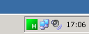
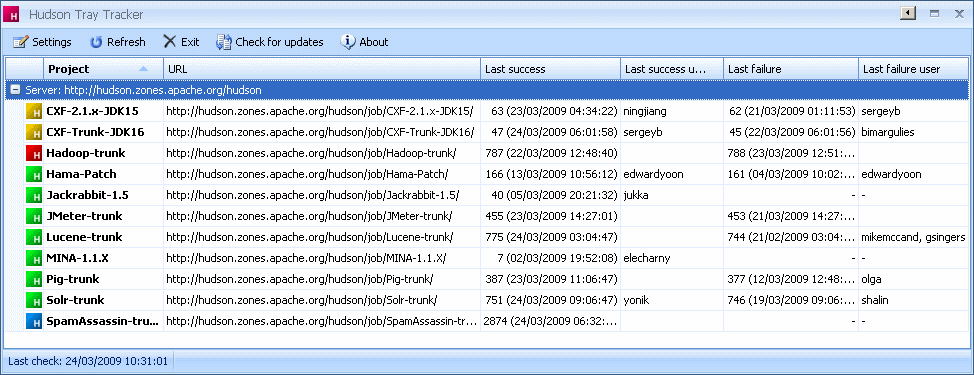
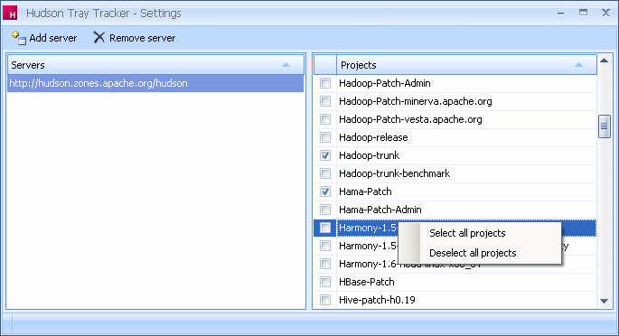

# Hudson Tray Tracker

**Hudson Tray Tracker** is an application which helps monitoring projects configured on a Hudson or Jenkins CI server (a continuous integration server). It sits in the Windows tray to display an icon showing the worst build status. That way, you know as soon as something goes wrong with one of the projects you are monitoring.

Here is a screenshot of what Hudson Tray Tracker looks like in the tray (see the green square with a 'H' within it):

The main features are:

* Multi-server support
* Project selection for each server
* Tray icon with bright colors:
  * green: all is good
  * yellow: at least one project has test failures
  * red: at least one project does not build
  * gray: at least one project is indeterminate
  * orange: currently building, and there was at least one project which did not build at the last check
  * blue: currently building, and there was no project which did not build at the last check
* Balloon warning in the tray when a project regresses (when a build fails, for instance)
* Open the project page (from the main window)
* Open the last build's console output (from the main window)
* Run a build (from the main window)
* Auto-refresh every 15 seconds
* Acknowledge a build failure: this makes as if the build was successful when choosing the tray icon
* Starts with Windows
* Application auto-update (checks at startup and every hour)

# Requirements

Hudson Tray Tracker runs on Microsoft Windows and requires Microsoft .Net framework 3.5 to be installed.

Here is a screenshot of the main window:

In the central panel:

* The projects are grouped by server. Here, there is only one: Apache's one.
* Each project has an icon displaying its status. A tooltip appears giving more details when you hover over a project.
* For each project, you get the following details:
  * project name
  * project page URL
  * last succes build number, time and user
  * last failure build number, time and user.
* You can double-click a project to display the project page. If the last build was a failure, the console output page is opened.
* From the context menu, you can:
  * open the project page
  * open the console output page
  * run a build (works only if anonymous users are authorized to run builds)
  * acknowledge a build failure (for the tray icon)
  * remove a project

In the toolbar:

* Settings: displays the settings window from which you can add/remove servers and add/remove projects.
* Refresh: refreshes the status of all the projects.
* Exit: closes the application (not only the main window).
* Check for updates: check for an application update.
* About: displays the about form.

# The settings window

Here is a screenshot of the settings window:

In the toolbar:

* Add server: opens a window in which you can type-in the URL of a server you would like to add.
* Remove server: remove the selected server from the list.

In the central panel:

* The left panel displays the list of servers.
* The right panel displays the projects located on the selected server.
* If you check/uncheck a project, changes are immediately taken into account.
* From the context menu, you can suscribe/unsuscribe to all the the projects with one click.

# Internals

## Project status update

Hudson Tray Tracker checks all the projects at a time by using the Hudson's XML API. This can take a minute or two if you are monitoring hundreds of projects. To make this process as fast as possible, 8 threads run in parallel and make up to 4 simultaneous requests per server.

To avoid checking without interruptions, a 15 seconds delay is imposed between the end of an update and the beginning of the next update.

## Auto-update

The auto-update checks at startup and every hour if a new version of the application is available. To do that, it compares the version number of the installed version with the current version number which can be found from https://github.com/aseigneurin/hudson-tray-tracker/blob/master/scripts/version.properties.

## Logs

Logs are written in `APP_DATA\Hudson Tray Tracker\Logs\`, where `APP_DATA` is `C:\Documents and Settings\login\Application Data\` (Windows XP and older) or `C:\Users\login\AppData\Roaming\` (Windows Vista).